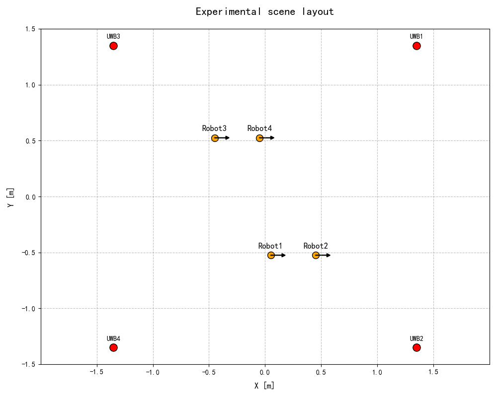
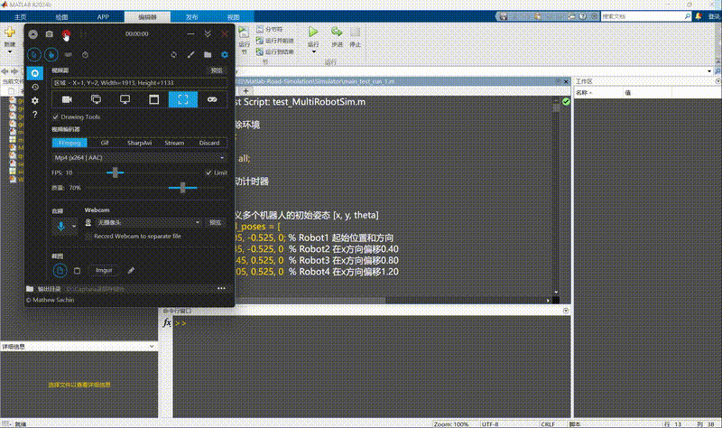
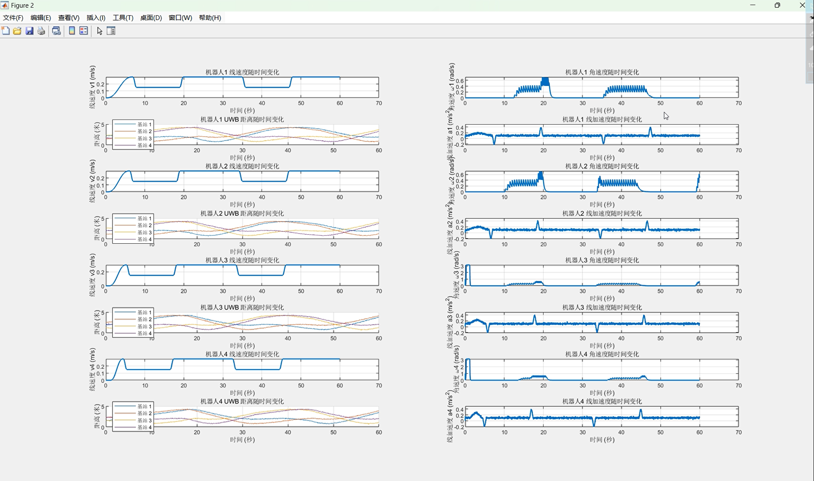
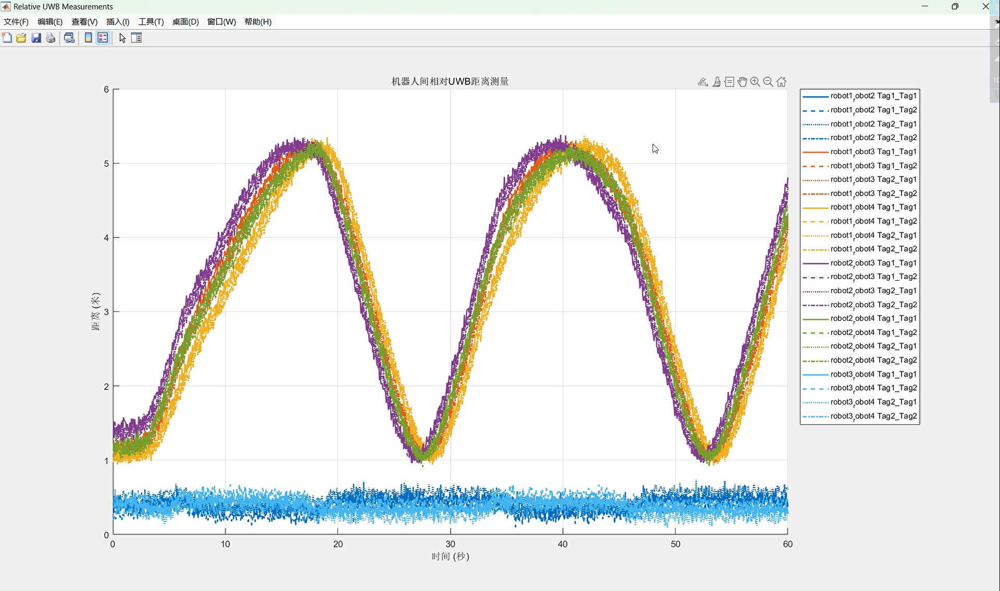

# 多机器人协同运动仿真器（Multi-Robot Simulator）

 

基于 MATLAB 的多机器人 Pure Pursuit 路径跟踪与 UWB/IMU 传感器模拟平台，支持多小车协同运动仿真，可生成高精度 IMU、UWB 距离测量及轨迹数据，用于后续因子图优化（GTSAM/iSAM2）室内协同定位研究。

---

## 项目简介

本仿真器是多机器人室内协同定位项目的核心仿真平台。其核心目标是**模拟多个轮式小车在给定环境中基于 Pure Pursuit 路径跟踪算法进行协同运动**，同时真实模拟 UWB（超宽带）测距、IMU（惯性测量单元）等传感器数据生成过程。

仿真器完整实现了：
- Pure Pursuit 路径跟踪控制（包含前视距离计算、线速度/角速度求解）
- 多机器人独立状态更新（单轨模型位置/姿态更新）
- UWB 距离测量模拟（小车到 4 个基站的距离 + 小车间相对测距，含噪声）
- IMU 数据模拟（加速度、角速度，含噪声）
- 小车中心到基站距离记录
- 全过程数据记录（生成 `.mat` 文件供后续因子图优化使用）

该仿真器可直接生成用于 **TDOA+卡尔曼滤波**（对照组）和 **因子图优化（iSAM2）** 的实验数据，支持不同噪声水平下的算法对比验证，是研究多机器人协同定位、传感器融合和路径规划的理想平台。

---

## 仿真效果展示

### 场景布局与初始设置

### 仿真运行演示（GIF）

### 仿真结果示例

---

## 主要特性

- ✅ **Pure Pursuit 控制器**：完整实现 lookahead distance 机制，支持自定义 waypoints
- ✅ **多机器人协同仿真**：通过 `MultiRobotSim.m` 统一管理，支持任意数量小车
- ✅ **高保真传感器模拟**：
  - UWB：4 个基站 + 每个小车 2 个标签，生成 `uwb_data` 结构体（含时间戳、Ranges_Tag1/Tag2）
  - IMU：实时加速度、角速度输出
  - 新增 `center_distances_data`：记录小车中心到各基站的真实距离
- ✅ **数据完整记录**：位置、姿态、速度、传感器原始数据全部保存为 `.mat`
- ✅ **可视化支持**：轨迹、速度曲线、UWB 距离、加速度等实时/事后绘图（配套 Python 绘图脚本）
- ✅ **易扩展**：模块化设计，便于修改路径、噪声、控制参数

---

## 项目背景与创新点

**背景**：传统单机器人室内定位存在精度低、误差累积等问题。本项目采用 UWB + IMU 多传感器融合，通过多智能体协同定位解决多机器人间定位一致性问题，提升整体精度和稳定性。

**创新点**：
- UWB 与 IMU 异构量测信息的强兼容性融合
- 集中式因子图优化架构（GTSAM 实现 iSAM2），支持即插即用多传感器
- 仿真器同时生成对照组（TDOA+卡尔曼滤波）和优化组（因子图）所需数据，实现毫米级定位精度验证

---

## 快速开始

### 环境要求
- MATLAB（推荐 R2023b 及以上）
- （可选）Python 3.9 + scipy/matplotlib，用于绘图

### 运行步骤
1. 打开 MATLAB，进入项目根目录下的 `Simulator` 文件夹。
2. **先运行**：`main_test（先运行）.m` （生成初始路网、边界、中心线和小车初始状态）。
3. **再运行**：`save_data（再运行）.m` （执行完整仿真循环，生成所有传感器数据并保存为 `.mat` 文件）。
4. （可选）运行 `绘图代码.py` 可视化结果。

仿真完成后，会生成 `simulation_test_data.mat` 等数据文件。

---

## 使用说明与参数调整

- 路径生成：在 `generate_road_polygon.m` 中修改路点（waypoints）
- 前视距离：在 Pure Pursuit 控制器初始化处修改 `LookaheadDistance`
- 噪声水平：在各传感器模拟函数中调整噪声参数
- 小车数量：在 `MultiRobotSim.m` 中修改机器人实例数量

---

## 许可证

本项目采用 **MIT License** 开源。详见 [LICENSE](LICENSE) 文件。

